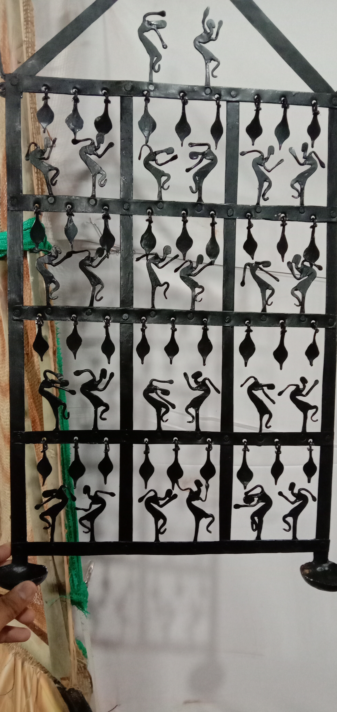

<!doctype html>
<html lang="en">
  <head>
    <!-- Required meta tags -->
    <meta charset="utf-8">
    <meta name="viewport" content="width=device-width, initial-scale=1, shrink-to-fit=no">

    <!-- Bootstrap CSS -->
    <link rel="stylesheet" href="https://stackpath.bootstrapcdn.com/bootstrap/4.1.3/css/bootstrap.min.css" integrity="sha384-MCw98/SFnGE8fJT3GXwEOngsV7Zt27NXFoaoApmYm81iuXoPkFOJwJ8ERdknLPMO" crossorigin="anonymous">

    <title>Hello, world!</title>
  </head>
  <body>
<table style="width:100%">
<tr>
 <th>E.Mail</th>
 <th>CONTACT NO</th>
 <th>id</th>
 </tr>
 <tr>
   <td>Contactme@gmail.com</td>
   <td>345627891</td>
   <td>MINEID</td>
 </tr>
 </table> 
<nav class ="navbar navbar-dark bg-dark">
<a class="navbar.brand color:white; bg-success">PRIYANSHA </a>

<button class="navbar-toggler" type="button" data-toggle="collapse" data-target="#navbarSupportedContent" aria-controls="navbarSupportedContent" aria-expanded="false" aria-label="Toggle navigation">
    
  </button>
<form name="form example">
FirstName<input type="text"> 
Lastname<input type="text"> 
Password<input type="password"> 
<input type="submit" value="login">
</form>
  

    <ul class="navbar-nav mr-auto">
      <li class="nav-item d-flex justify-content-center">
        <a class="nav-link" href="#about">About (current)</a>
      </li>
      <li class="nav-item d-flex justify-content-center">
        <a class="nav-link" href="#information">Information</a>
      </li>
            <li class="nav-item d-flex justify-content-center">
        <a class="nav-link " href="#image">Images</a>
      </li>
    </ul>

</nav>

<h1 style="color:blue;">MYSELF</h1>

<h2 style="color:purple;">My name is Priyansha Jaiswal</h2>
<h2 style="color:purple;">I am currently in 2 year</h2>
<h2 style="color:purple;">KIIT University</h2>
<button  style="color:blue;" type="button" class"btn Contact me">CONTACT</button>

<h1 style="color:blue;">Web Development</h1>

<source src="holi.mp4" type="video/mp4">

Web  develpoment is the work involved in develpoing a web site for the internet  or an develpoing a Web site for the internet or an intranet.web development can range from developing  a simple single static page of plain text  to complex Web-based internet  applications, business and social network

  

  <ol class="carousel-indicators">
    <li data-target="#carouselExampleIndicators" data-slide-to="0" class="active"></li>
    <li data-target="#carouselExampleIndicators" data-slide-to="1"></li>
    <li data-target="#carouselExampleIndicators" data-slide-to="2"></li>
  </ol>
  

    

      
    

    

      
    

    

      
    

  

  <a class="carousel-control-prev" href="#carouselExampleIndicators" role="button" data-slide="prev">
    
    Previous
  </a>
  <a class="carousel-control-next" href="#carouselExampleIndicators" role="button" data-slide="next">
    
    Next
  </a>

    
    
    
  </body>
</html>